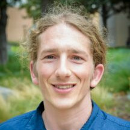
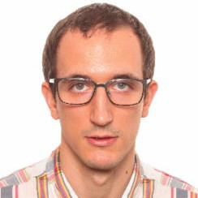

## QuantImage v2 platform
QuantImage v2 (QI2) is an open-source web-based platform for no-code clinical radiomics research. It has been developed with the aim to empower physicians to play a leading role in clinical radiomics research. We believe that tighter involvement of domain experts is critical to ensuring the clinical relevance of radiomics research and will lead to the development of better interpretable and more generalizable radiomics models.

### Citing QuantImage v2
**If you are using QuantImage v2 in your research, please cite the following publication:**

Abler, D., Schaer, R., Oreiller, V. *et al.* QuantImage v2: a comprehensive and integrated physician-centered cloud platform for radiomics and machine learning research. *Eur Radiol Exp* **7**, 16 (2023). [https://doi.org/10.1186/s41747-023-00326-z](https://doi.org/10.1186/s41747-023-00326-z)

### One-stop tool for clinical radiomics research
To implement this vision, and different to most other radiomics softwares, QI2 supports **all steps of a typical radiomics study workflow**:
* allowing the user to create patient cohorts, 
* extracting radiomics features from regions of interest (ROIs) of CT/PET/MR images, 
* exploring and selecting features using visualisation, as well as  
* creating and evaluating machine learning models for  classification and survival tasks. 

Furthermore, QI2 was designed to **integrate well into the clinical environment**:
* providing PACS-like functionality for managing imaging studies, 
* ubiquitous access through a web portal, and 
* guiding the user through the radiomics analysis processs.

### Built upon established Open-Source components
QI relies on established components for medical image management, radiomics feature computation and machine learning, including [Kheops](https://github.com/OsiriX-Foundation/kheops), an open-source web-based for managing collections of DICOM images, [pyradiomics](https://pyradiomics.readthedocs.io/en/latest/index.html) for feature extraction and [scikit-learn](https://scikit-learn.org/stable/) / [scikit-survival](https://scikit-survival.readthedocs.io/en/stable/) for machine learning model development and evaluation.

### Overview
The video below is an introduction to the QuantImage v2 radiomics research platform and its features:

<!-- Video does not appear in the Preview, but is visible on the deployed website -->
<video style='max-width: 832px; max-height: 832px' controls><source src='https://drive.switch.ch/index.php/s/3Tom8ZnIF8wl2r3/download' type='video/mp4'>Video Not Suppported</video>

## Getting Started
You can try out the platform <a href="https://quantimage2.ehealth.hevs.ch" target="_blank">here</a>. Registration gives you access to a fully functional installation of QuantImage. 
<!-- info about available dataset & sign-up process  -->
We are preparing information and pointers to public datasets for testing, more details will be available soon. 

**In order to get access to the testing datasets**, first log into the [Kheops Platform](https://kheops.ehealth.hevs.ch) once to initialize your user account, then 
<a href='mail&#116;o&#58;adrie%6E&#37;2E%&#54;&#52;%&#54;5&#112;&#37;&#54;5&#37;&#55;&#53;rs&#37;69%6&#69;ge&#64;&#104;&#37;&#54;5&#37;76%73&#46;&#99;%6&#56;?subject=REQUEST - QuantImage v2 Testing Datasets Access'>contact us</a>
to request the access to the datasets.

### QuantImage v2 Virtual Machine
To make it easy for you to **test QI2 with your data**, we provide QI2 as a ([VirtualBox](https://www.virtualbox.org/)) Virtual Machine image <a href="https://fast.hevs.ch/quantimage-v2-vm-download" target="blank" rel="noopener noreferrer">here</a>.

**NOTE** : The download (zip archive, ~13GB) includes a README.md file with indications on login credentials, updating the platform, etc. The QuantImage v2 Virtual Machine is pre-configured to use 8GB of RAM & 4 CPUs, which corresponds to the minimum specifications for running the platform smoothly. 

### QuantImage v2 source code

#### Setup Script (requires Docker & Git)
To easily get started and create a running instance of the full platform (Kheops, QuantImage v2 Frontend & Backend, Keycloak, OHIF Viewer, etc.), clone the following repository and run the setup script as described in the README.md file : 

* Setup & Update Scripts : <https://github.com/medgift/quantimage2-setup>

#### GitHub Repositories
Here are the links for the various repositories the full platform consists of:

* QuantImage v2 Kheops configuration : <https://github.com/medgift/quantimage2-kheops>
* QuantImage v2 Backend & associated tools : <https://github.com/medgift/quantimage2_backend>
* QuantImage v2 Frontend : <https://github.com/medgift/quantimage2-frontend>

## Team

### Core Team
<table class="team-table">
  <tr>
    <td valign="top"></td>
    <td valign="top"></td>
    <td valign="top"></td>
    <td valign="top"></td>
  </tr>
  <tr>
    <td>
        <a href="https://medgift.hevs.ch/wordpress/team/adrien-depeursinge/">Adrien Depeursinge</a>
    </td>
    <td>
        <a href="https://medgift.hevs.ch/wordpress/team/daniel-abler/">Daniel Abler</a>
    </td>
    <td>
        <a href="https://medgift.hevs.ch/wordpress/team/roger-schaer/">Roger Schaer</a>
    </td>
    <td>
        <a href="https://medgift.hevs.ch/wordpress/team/valentin-oreiller/">Valentin Oreiller</a>
    </td>
  </tr>
</table>

### Contributors

#### CHUV

* [Pr John O. Prior](https://centrescancer.chuv.ch/specialiste/john-prior)
* [Dr Mario Jreige](https://applicationspub.unil.ch/interpub/noauth/php/Un/UnPers.php?PerNum=1216661&LanCode=8)

#### HES-SO Valais

* [Dr Florian Evéquoz](https://www.hevs.ch/en/collaborateurs/evequoz-1589)

#### USZ

* [Dr Stephanie Tanadini-Lang](https://www.usz.ch/team/stephanie-tanadini-lang)

## Support & Funding
Research and development of QuantImage v2 was supported by

    
    
    

